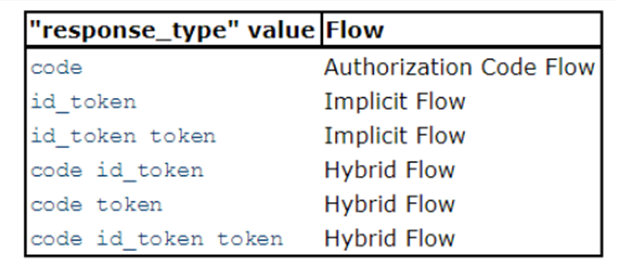

= General view of authentication procedures

== Authentication Flows
In order to interact with this service, it is necessary to implement one of the three authorization flows defined by OpenID Connect 1.0 standard: implicit flow, authorization code flow and hybrid flow.

* Implicit flow. This method is recommended for browser-based apps. Its main steps are:

1.	A request is made to the Authorization Endpoint. The Authorization Server will redirect the user to the sign-in page.
2.	The end-user will then authenticate with a set of required credentials.
3.	The Authorization Server will answer back with a redirection URI and an Access Token.
4.	The Access Token can be used to request information about the end-user via the User Info Endpoint.

* Authorization Code flow. This method is recommended for apps running on a web server or native mobile applications. Its main steps are:

1.	A request is made to the Authorization Endpoint. The Authorization Server service will redirect the user to the sign-in page.
2.	The end-user will then authenticate with a set of credentials required.
3.	The Authorization Server will answer back with an authorization code.
4.	The Client can now use the received code to request an Access Token through the Token Endpoint.
5.	Once the client application has acquired an Access Token, it will be possible to request information about the end-user via the User Info Endpoint.

* Hybrid Code flow. This method merges characteristic from both of the previously mentioned methods. Currently, the usage of this method is not recommended with the Authorization Server.

To implement any of the flows, it is necessary to specify the response type on the request to the Authorization Server. OpenID Connect specification indicates the combination of response types necessary to implement each flow:

[#img_oidc_reponse_types,reftext='{figure-caption} {counter:figure-num}']
.Response Types on OpenID Connect

== Client authentication

When accessing the Token Endpoint, clients using the implicit flow are not required to be authenticated, but if the client uses the Authorization Code Flow, it must provide its credentials.

These credentials will be provided by NextGEOSS UM: client_id and client_secret.

== Request Endpoints for Authentication
All endpoints require a set of mandatory parameters in order to generate a valid response. Their URLs can be obtained by means of a Discovery URI that answers back with a set of endpoints and their URLs. All these URLs must be accessed by means of a GET request, and require a set of mandatory parameters:

*	*Discovery URI*: /.well-known/openid-configuration

*	*Authorization Endpoint* (GET): /oxauth/restv1/authorize
Parameters:
** scope: The request should include an array of scopes, with one of them being “openid”.
** response_type: Its value should be desired combination according to the OpenID Connect response type table.
** client_id: Provided by NextGEOSS UM.
** redirect_uri: It should point to the client application and match the URI given on the acceptance request.
** state (optional): Opaque value used to maintain state between the request and the callback. Typically, Cross-Site Request Forgery (CSRF, XSRF) mitigation is done by cryptographically binding the value of this parameter with a browser cookie.
** nonce (optional/*required for Implicit Flow*): String value used to associate a Client session with an ID Token, and to mitigate replay attacks (it can have ANY value)

.Example:
[source,url]
GET oxauth/restv1/authorize?scope=openid&client_id=@!5C7F.E36B.5DE3.15EE!0001!6B53.87B4!0008!A121.D32B.8BCD.4E14&redirect_uri=app://test&response_type=code

If the application is trying to authenticate without user input, user credentials must be provided through the Authorization header. The code will be encoded as a parameter in the Location response header.

*	*Token Endpoint* (POST): /oxauth/restv1/token
** grant_type: implicit / authorization_code (depending on the authorization flow).
** Code*: Used only with grant_type=authorization_code
** redirect_uri: It should point to the client application and match the URI given on the acceptance request.
** scope: The request should include an array of scopes, with one of them being “openid”.
** client_id*: Provided by NextGEOSS UM, only necessary with grant_type=authorization_code.
** client_secret*: Provided by NextGEOSS UM, only necessary with grant_type=authorization_code
