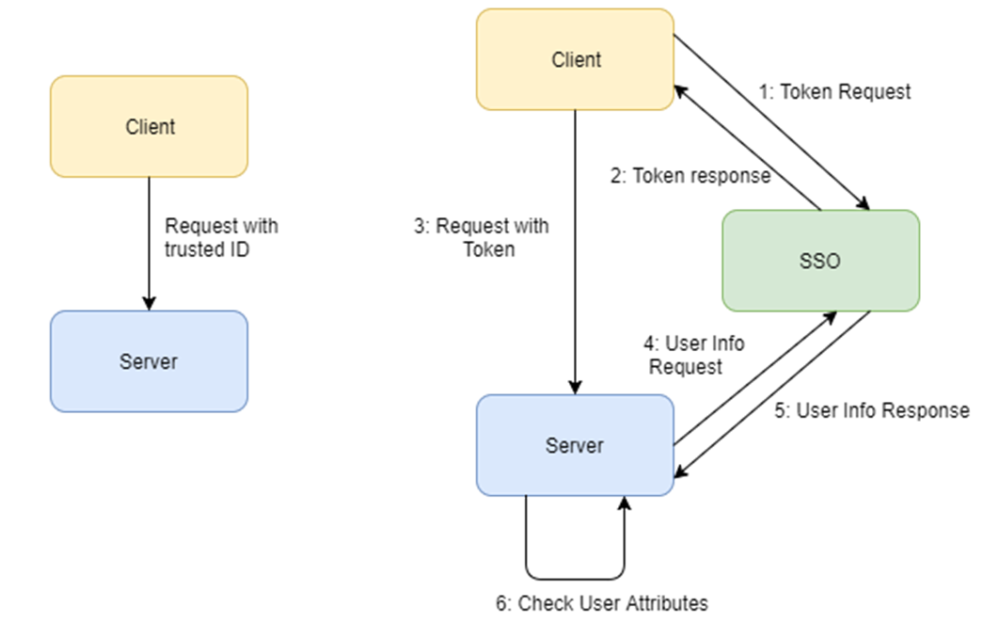

= Implementation on the Service Side
== Token Validation and End-user Authorization

Use this Endpoint to acquire user information:

* *User-Info Endpoint (GET)*: /oxauth/restv1/userinfo
** access_token: Acquired via Token or Authorization endpoints.

.Example:
[source,url]
GET oxauth/restv1/userinfo?access_token=<TOKEN>

[NOTE]
.The "sub" parameter
===============================================
When using the openid scope, the Authorization Server will always answer with a "sub" parameter that is supposed to identify an End-User with a unique string. This will only be the case for the Authorization Grants mentioned in this Integration Guide. Other flows might collapse all subs into the client_id to avoid unintentionally leaking user information with non-OpenID grants.
===============================================

== Service-Side Authorization
Any Service should define which user attributes are required to interact with its services. After that, any received request must contain an access token (obtained using the Authorization/Token Endpoint).

Using the NextGEOSS UM Service, it is possible to implement authorization measures in order to protect access to a registered resource. Although each client can implement its own independent authorization methods, the two main options made available by NextGEOSS are the usage of scopes and UMA.

This access token can be included in an internal request to the Authorization Server User Info Endpoint, which returns the set of default attributes that can be checked internally by the service in order to determine if access should be granted.

[#service_authz,reftext='{figure-caption} {counter:figure-num}']
.Service-Side Authorization example

In this image, the Server does not know if the Client is the one performing the Token Request.

=== Scope-based Authorization

It is possible to define a list of attributes indicating which users can or cannot access a service/resource. These attribute can be associated to an OpenID scope (default is geoss_user) that allows to discriminate the access to the resources/operations between users. So far, the following basic boolean attributes are defined for each end-user:

* *Harvesting (harvestingUser)*: Allows retrieval of metadata from a registered Data Provider API. By default, the attribute is set to false. The administrator will be able to modify the attribute value.
* *Discovery (discoveryUser)*: Allows querying of records from a registered catalog API. By default, the attribute is set to true.
* *Catalogue (catalogueUser)*: Allows updating/modifying records from a registered catalog service . By default, the attribute is set to false. The administrator will be able to modify the attribute value.
* *Access (accessUser)*: Allows direct access to data on a registered data server. By default, the attribute is set to false. The administrator will be able to modify the attribute value. 
* *Processing (processingUser)*: Allows the processing of datasets on a registered processing service. By default, the attribute is set to false. The administrator will be able to modify the attribute value.
* *Analytics (analyticsUser)*: Allows access to NextGEOSS analytics platforms (i.e: User Management KPIs). By default, the attribute is set to false. The administrator will be able to modify the attribute value.

All this information can be used to provide claims about users interacting with external clients and using the authentication flows previously mentioned. On the other hand, internal clients should be implemented using a set of specific default users, taking into account the following figure and sections.

=== UMA Authorization

[NOTE]
.Not available
===============================================
UMA Authorization is currently not enabled but will be made available to developers in the future.
===============================================
